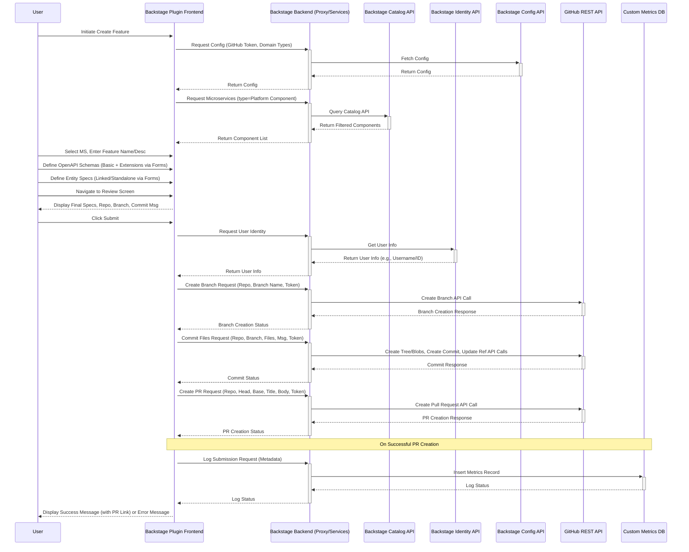

# Technical Specification: Backstage OpenAPI & Entity Specification Plugin (MVP)

**Version:** 1.0
**Date:** 2024-08-19
**Status:** Ready for Development
**Authors:** [Collaborative Session based on User Input]
**Contact:** [User/Product Owner]

## 1. Introduction

### 1.1. Overview
This document specifies the requirements and technical design for a Backstage Frontend Plugin enabling developers to define OpenAPI (v3.x) specifications and associated JPA Entity metadata within an API-first workflow. The plugin aims to streamline the initial stages of microservice feature development by standardizing spec creation and automating the Git commit/Pull Request process, integrating with existing downstream code generation pipelines.

### 1.2. Goals
*   **Increase Developer Productivity:** Reduce manual effort for spec/boilerplate creation from ~1 day to < 30 minutes.
*   **Enforce Standardization:** Ensure consistent use of vendor extensions and domain data types.
*   **Improve Code Consistency:** Promote uniform API and entity design across teams.
*   **Streamline Workflow:** Automate Git interactions for spec file commitment and PR creation.

### 1.3. Problem Context
Manual spec creation and boilerplate coding is slow, error-prone, leads to inconsistencies, and adds friction to the development lifecycle. This plugin addresses the upstream part of this problem by providing a guided UI for creating the necessary specification artifacts.

### 1.4. Scope (MVP)
*   Backstage Frontend Plugin UI for defining OpenAPI (YAML) and Entity (JSON) specs.
*   Support for specific vendor extensions (`x-fbp-*`) via structured forms.
*   Support for defining standalone entities.
*   Use of a predefined, configurable list of Domain Data Types for entity fields.
*   Automated commit of generated spec files (`.yaml`, `.json`) to a new feature branch in GitHub.
*   Automated Pull Request creation against a hardcoded `develop` branch using a Service Account Token.
*   Logging of successful submissions to a custom Backstage database table for metrics.
*   **Out of Scope:** Downstream code generation, DTO generation/repo handling, advanced Git operations (rebasing, etc.), complex spec validation (linting beyond structure), user Git token handling, UI for editing *existing* specs (create-only workflow for MVP).

## 2. Architecture & Technical Design

### 2.1. Component Overview
*   **Type:** Backstage Frontend Plugin.
*   **Placement:** Integrated into the Backstage UI, likely accessible via the "Create..." menu or a dedicated tool page.
*   **Key Interactions:**
    *   Backstage Catalog API: To list and filter microservices (`Component` kind).
    *   Backstage Identity API: To retrieve logged-in user information (for PR description).
    *   Backstage Config API: To read GitHub integration settings (token, API URL if needed) and the Domain Data Types configuration.
    *   GitHub REST API: To create branches, commit files, and create Pull Requests.
    *   Backstage Database (via Backend Plugin/API - *Implicit Requirement*): To log successful submissions for metrics. A corresponding backend change might be needed to expose an API for this logging or it needs to be handled securely from the frontend if permissible.

### 2.2. Tech Stack
*   **Frontend:** React, TypeScript, Material UI (leveraging Backstage component library, e.g., `core-components`, `catalog-client`, `config-api`, `identity-api`).
*   **YAML/JSON Handling:** `js-yaml` library for parsing/stringifying YAML. Standard JSON methods.
*   **Code Editor:** Monaco Editor or CodeMirror (via suitable React wrappers) for displaying/editing OpenAPI spec.
*   **API Clients:** Backstage SDK clients for Backstage APIs. `Octokit` (or similar fetch-based calls) for GitHub REST API, likely routed via Backstage backend proxy for authentication.
*   **State Management:** React Hooks (`useState`, `useReducer`) or potentially Zustand/Redux Toolkit if complexity warrants it.

### 2.3. Data Flow Diagram (Conceptual)


### 2.4. Key GitHub API Interactions (via Backstage Backend Proxy)
*   **Authentication:** Use the configured Service Account Token (Bearer Token Authentication).
*   **Branch Creation:** `POST /repos/{owner}/{repo}/git/refs` (create `refs/heads/feature/<feature-name>` pointing to the SHA of the `develop` branch head).
*   **File Commitment (Multi-step):**
    1.  (Optional) Create Blobs: `POST /repos/{owner}/{repo}/git/blobs` for each file (`.yaml`, `.json`) to get their SHAs. Can sometimes send content inline in the Tree step if small enough.
    2.  Create Tree: `POST /repos/{owner}/{repo}/git/trees` providing the file paths, modes (e.g., `100644`), types (`blob`), and SHAs (from step 1 or inline content). Set `base_tree` to the SHA of the `develop` branch's tree.
    3.  Create Commit: `POST /repos/{owner}/{repo}/git/commits` with the new tree SHA, parent commit SHA (tip of `develop`), and the commit message.
    4.  Update Branch Reference: `PATCH /repos/{owner}/{repo}/git/refs/heads/feature/<feature-name>` to point the feature branch ref to the new commit SHA.
*   **Pull Request Creation:** `POST /repos/{owner}/{repo}/pulls` specifying `head` (feature branch name), `base` (`develop`), `title` (Feature Name), and `body` (Description + "PR initiated by: ..." text).

## 3. Detailed Functional Requirements

*(Refers to User Stories in PRD Section 3 for context)*

### 3.1. UI Component: Initial Setup
*   Triggered via Backstage "Create..." or dedicated page.
*   Screen displays:
    *   Text Input: "Feature Name" (Required).
    *   Text Area: "Description" (Required).
    *   Component Selector: Dropdown/Picker populated by querying Backstage Catalog API for `kind: Component`, filtered `spec.type: "Platform Component"`. Displays component `metadata.name`. (Required selection).
    *   "Start Defining Specs" Button (or similar).

### 3.2. UI Component: Specification Editor View
*   Main view after setup. Displays the Feature Name prominently.
*   Contains:
    *   **OpenAPI Editor Panel:**
        *   Uses Monaco/CodeMirror editor instance, configured for YAML.
        *   Pre-populated on load with template (See Appendix A). `info` section filled from Setup step.
        *   "Add Schema" button.
    *   **Schema Definition Area (Dynamic):**
        *   When "Add Schema" is clicked, prompts for schema name.
        *   Adds a section/card for the new schema, allowing input of basic OpenAPI fields (potentially within the main editor or a focused sub-editor).
        *   Displays "Prepare Vendor Extensions for <SchemaName>" button per schema.
    *   **Entity Definition Area:**
        *   "Add Standalone Entity" button.
        *   Sections/cards appear here when `generatePersistenceLayer: true` is set for a schema OR when "Add Standalone Entity" is clicked.
        *   Displays "Define/Edit Entity for <SchemaName>" or "Define/Edit Standalone Entity" button per entity.
    *   **Navigation:** "Review" button (enabled when ready).

### 3.3. UI Component: Vendor Extension Forms
*   Triggered by "Prepare Vendor Extensions".
*   Parses the *current* YAML content of the specific schema using `js-yaml`. Handles parsing errors gracefully.
*   Displays a Modal Dialog or Side Panel containing forms for:
    *   `x-fbp-props`: For each property found in the schema, display a text input for `businessName`.
    *   `x-fbp-params`: Forms for all sub-properties (`repoMethods`, `overrideMethods`, etc.). Use appropriate controls:
        *   Lists for arrays (e.g., `repoMethods`, `endPoints`, `interfaces`, `nonModifiableAttributes`) with Add/Remove functionality.
        *   Text inputs, text areas (e.g., for `query`, `body`).
        *   Checkboxes/Toggles for booleans (`rootSchema`, `persist`, `setDefaults`, `isModifiable`).
        *   Flag `generatePersistenceLayer` (Checkbox/Toggle).
    *   `x-fbp-enum-name`: Input displayed alongside schema properties of type `enum`.
*   Includes "Preview Extensions" and "Apply Extensions" buttons.

### 3.4. UI Component: Entity Specification Form
*   Triggered by "Define/Edit Entity..." buttons.
*   Displays a Modal Dialog or dedicated section.
*   Form Fields:
    *   `entityName` (Read-only if linked to schema, editable if standalone).
    *   `tableName` (Text input, optional).
    *   **Fields Section (Table/List):**
        *   Populated from schema properties if linked, otherwise starts empty for standalone. Allows adding/removing fields for standalone.
        *   For each field: `fieldName` (read-only if linked), `columnName` (optional text input), `domainDataType` (required dropdown populated from `app-config.yaml` via Config API), `isPrimaryKey` (toggle), `primaryKeyGenerationStrategy` (dropdown, enabled if PK), `isNullable` (toggle).
    *   **Relationships Section (Table/List):**
        *   Allows adding/removing relationships.
        *   For each relationship: `fieldName` (text input), `targetEntity` (required dropdown listing *all other entity names* currently defined in the plugin's state), `relationshipType` (dropdown), `mappedBy` (optional text), `fetchType` (dropdown), `cascadeOptions` (multi-select), `joinColumnName` (optional text).
*   Includes "Save Entity Spec" button. Updates internal plugin state.

### 3.5. UI Component: Review Screen
*   Displays read-only view of:
    *   Final OpenAPI YAML (using editor component).
    *   List of Entity Specs: Each `entityName` is a title for an expandable section containing the formatted JSON of that entity spec.
    *   Target Repository URL (derived from selected component's annotations).
    *   Generated Branch Name (`feature/<sanitized-feature-name>`).
    *   Generated Commit Message (`feat: Define API specification...`).
*   Includes "Submit" button. (No "Back" button in MVP).

### 3.6. Submit Logic
*   Triggered by "Submit" button on Review screen.
*   Performs sequence of actions (refer to Data Flow and GitHub API sections).
*   Fetches user identity info for PR description.
*   Constructs file content (YAML string for OpenAPI, JSON strings for Entities).
*   Makes sequential calls to GitHub API via backend proxy.
*   Handles responses, displaying success (with PR link) or specific error messages.
*   On successful PR creation, makes a call to log metadata to the custom Backstage DB table (See Logging).

### 3.7. State Management
*   Maintain component state for: Selected Microservice, Feature Name, Description, OpenAPI YAML content (potentially debounced), list of defined Schema states (including extension data), list of defined Entity Spec states (linked & standalone), current UI step/view.

## 4. Data Models

### 4.1. OpenAPI Specification (`<feature-name>.yaml`)
*   Format: YAML, compliant with OpenAPI 3.x.
*   Must include standard sections (`openapi`, `info`, `servers`, `paths`, `components`).
*   `info` section populated from user input. `servers` initially empty. `paths` generated downstream based on `endPoints`.
*   **Vendor Extensions (`x-fbp-*`):** Structures must match the agreed format based on examples and discussion. See Appendix B for detailed structure examples. Must handle arrays correctly (e.g., multiple `repoMethods`, `endPoints`).
*   `generatePersistenceLayer: boolean` flag within `x-fbp-params`.

### 4.2. Entity Specification (`<EntityName>.entity.json`)
*   Format: JSON. One file per entity defined.
*   Structure:
    ```json
    {
      "entityName": "String", // Required
      "tableName": "String | null", // Optional user override
      "fields": [
        {
          "fieldName": "String", // Required
          "columnName": "String | null", // Optional user override
          "domainDataType": "String", // Required, value must exist in configured list
          "isPrimaryKey": "Boolean", // Required
          "primaryKeyGenerationStrategy": "'AUTO' | 'SEQUENCE' | 'IDENTITY' | 'NONE' | null", // Required if isPrimaryKey=true
          "isNullable": "Boolean" // Required
        }
        // ... more fields
      ],
      "relationships": [
        {
          "fieldName": "String", // Required
          "targetEntity": "String", // Required, name of another entity in this session
          "relationshipType": "'OneToOne' | 'OneToMany' | 'ManyToOne' | 'ManyToMany'", // Required
          "mappedBy": "String | null", // Optional
          "fetchType": "'LAZY' | 'EAGER'", // Required, default LAZY?
          "cascadeOptions": ["String"], // Optional array (e.g., ["PERSIST", "MERGE"])
          "joinColumnName": "String | null" // Optional override
        }
        // ... more relationships
      ]
    }
    ```

## 5. Configuration (`app-config.yaml` or dedicated file)

*   **GitHub Integration:**
    *   Service Account Token (Stored securely, accessed via backend/proxy).
    *   (Optional) GitHub API Base URL (for GHE).
*   **Plugin Specific:**
    *   `listDomainDataTypes`: An array of strings defining the valid entries for the `domainDataType` dropdown. Example: `['String(20)', 'String(256)', 'IdentifierUUID', 'FlagYN', 'BusinessDate', 'Decimal(10,2)']`. This list must be maintained externally.
*   **Implicit:** Target PR branch (`develop` - hardcoded for MVP).

## 6. Error Handling Strategy

*   **Input Validation:** Use standard form validation (required fields, basic formats) within the UI. Provide inline error messages.
*   **YAML/JSON Parsing:** Catch errors during "Prepare Extensions" or potentially on editor changes. Display clear messages indicating parsing issues.
*   **Backstage API Calls:** Handle errors (network, 4xx, 5xx) from Catalog, Identity, Config APIs. Show user-friendly notifications (e.g., "Could not load microservices list"). Log details.
*   **GitHub API Calls:**
    *   Handle errors for *each step* (branch creation, commit steps, PR creation).
    *   Provide specific feedback based on HTTP status codes (e.g., 409 Conflict on branch exists, 401/403 for token/permission issues, 422 for validation errors, 404 for repo not found).
    *   Display error messages clearly in the UI (e.g., using Material UI `Alert` or `Snackbar`).
    *   **No automatic rollback** on failures during the multi-step commit/PR process. Log detailed errors to console/Backstage logging.
*   **General:** Use non-blocking UI notifications for transient errors. Prevent submission if critical errors exist.

## 7. Security Considerations

*   **GitHub Token:** MUST be handled securely. Recommended approach is using the Backstage backend proxy pattern where the token resides on the server/in secrets management and the frontend calls a backend endpoint which then interacts with GitHub. Avoid exposing the token directly to the frontend.
*   **Permissions:** The Service Account Token must have the minimum required permissions on target repositories: `contents: write` (for commits/branches), `pull_requests: write`. Read access is implicitly needed.
*   **Input Sanitization:** While primarily an internal tool, sanitize user inputs (Feature Name, Description) if they are displayed directly in HTML to prevent potential XSS (low risk). The generated YAML/JSON content itself doesn't require sanitization as it's treated as data/code.
*   **Dependencies:** Keep frontend and backend dependencies up-to-date to mitigate security vulnerabilities.

## 8. Logging & Monitoring

*   **Frontend Logging:** Log key user interactions (view load, feature started, schema added, entity added, review shown, submit clicked) and any caught errors to the browser console / Backstage frontend logging framework.
*   **Backend Logging (Metrics):** On *successful* PR creation, log metadata to a custom Backstage database table.
    *   **Table Schema (Example):** `plugin_openapi_submissions`
        *   `id` (PK, Auto-increment/UUID)
        *   `submission_timestamp` (Timestamp, default NOW())
        *   `user_id` (String, from Backstage Identity)
        *   `microservice_ref` (String, entity ref like `component:default/my-service`)
        *   `feature_name` (String)
        *   `openapi_schema_names` (TEXT/JSON array of strings)
        *   `entity_spec_names` (TEXT/JSON array of strings)
        *   `pull_request_url` (String)
    *   Requires a mechanism (likely a backend API endpoint called by the plugin frontend) to perform this database write securely.

## 9. Testing Plan

### 9.1. Unit Tests (Jest / React Testing Library)
*   Test individual React components (rendering, basic interaction).
*   Test form validation logic.
*   Test utility functions (YAML parsing/generation helpers, state transformation logic).
*   Mock Backstage SDK hooks/functions (`useApi`, `catalogApiRef`, `configApiRef`, `identityApiRef`).
*   Mock GitHub API interactions (via mocked backend proxy calls).

### 9.2. Integration Tests (React Testing Library)
*   Test the flow between related components (e.g., selecting MS enables spec editor).
*   Test state updates across components (adding a schema enables extension button).
*   Test form submission logic with mocked API calls, verifying payload construction.
*   Test parsing logic and dynamic form generation based on input YAML.

### 9.3. End-to-End Tests (Cypress / Playwright)
*   Simulate the full user workflow in a running Backstage instance (requires test environment).
    *   Navigate to the plugin.
    *   Select a mock component from the catalog.
    *   Enter feature name/description.
    *   Add a basic schema.
    *   Trigger and fill vendor extension forms.
    *   Add a linked entity and a standalone entity, fill forms including relationships.
    *   Navigate to Review screen, verify displayed data.
    *   Click Submit.
    *   Verify (mocked) GitHub API calls are made with correct parameters OR verify logs/DB entries if possible.
    *   Test error scenarios (e.g., submitting with invalid data, simulating GitHub API errors).

### 9.4. User Acceptance Testing (UAT)
*   Performed by target backend developers/tech leads.
*   Provide realistic scenarios (simple API, complex API with multiple entities/relationships).
*   Verify usability, clarity of instructions/forms, correctness of generated YAML/JSON files (manual inspection in created branch/PR), and successful PR creation.
*   Gather feedback on workflow and potential improvements.

## 10. Deployment Considerations

*   Standard Backstage plugin deployment process.
*   **Prerequisites:**
    *   The custom database table for logging must be created in the Backstage database.
    *   A secure mechanism for storing and accessing the GitHub Service Account Token must be configured (likely via Backstage backend secrets).
    *   The Domain Data Types list must be configured in the Backstage application configuration.
    *   If a backend component is needed for DB logging or GitHub proxying, it must be deployed alongside the frontend plugin.

## 11. Future Considerations

*   Implement "Back" button on Review screen.
*   Explore advanced error handling/rollback strategies.
*   Investigate user-based GitHub token authentication.
*   Add configuration options for branch names, commit messages, target PR branch.
*   Support advanced JPA/Entity features (composite keys, inheritance).
*   Formalize Domain Data Type list management.
*   Implement Import/Export functionality for specs.
*   Add advanced spec validation/linting.
*   Consider a non-committing code generation preview.
*   UI for *editing* specs created previously by the plugin.

---

## Appendix A: Basic OpenAPI Template (YAML)

```yaml
openapi: 3.0.3
info:
  title: {{FEATURE_NAME}} # Populated from user input
  version: 1.0.0 # Default
  description: {{DESCRIPTION}} # Populated from user input
servers: [] # Empty by default
paths: {} # Empty by default, generated downstream
components:
  schemas: {} # Empty by default
```

## Appendix B: Vendor Extension Structure Examples (`x-fbp-*`)

*(Based on provided `TargetSystemErrorCodeMapping.json` and discussion)*

```yaml
components:
  schemas:
    ExampleSchema:
      type: object
      required:
        - field1
      properties:
        id:
          type: string
          format: uuid
          readOnly: true
          x-fbp-props:
            businessName: "Identifier" # Simple key-value prop
        field1:
          type: string
          minLength: 1
          x-fbp-props:
            businessName: "Field One"
        enumField:
          type: string
          enum: [VAL1, VAL2]
          x-fbp-enum-name: "MyEnumType" # Enum name hint
          x-fbp-props:
            businessName: "Enumeration Field"
      # Schema-level extensions
      x-fbp-params:
        rootSchema: true # Boolean flag
        generatePersistenceLayer: true # Boolean flag
        repoMethods: # Array of objects
          - query: "from ExampleSchema es where es.field1 = :field1"
            fetchMethod: "findByField1"
            fetchParams: "String field1"
        overrideMethods: # Array of objects
          - type: "String"
            function: "getComputedValue"
            params: "String input"
            body: "return input.toUpperCase();"
        interfaces: # Array of objects
          - iface: "ITimestamped"
            package: "com.example.interfaces"
        endPoints: # Array of objects defining API operations
          - name: "createExample"
            type: "create" # E.g., create, update, fetch, delete
            singleRequest: false # For list requests
            singleResponse: false # For list responses
            parameters: # Parameters for the operation
              - name: "param1"
                description: "Parameter description"
                type: "string" # OpenAPI type
                example: "exampleValue"
                path: true # Or query: true, header: true, etc.
                requiredParam: true
          - name: "fetchExample"
            type: "fetch"
            singleResponse: true
            repoMethod: "findByField1" # Links to repoMethods name
            parameters:
              - name: "field1"
                description: "Filter by field one"
                type: "string"
                query: true # Example query param
                requiredParam: true
        behaviours: # Object with boolean flags
          persist: true
          setDefaults: false
        isModifiable: true # Boolean flag
        nonModifiableAttributes: # Array of strings (field names)
          - "id"
          - "creationDate"

```
---
